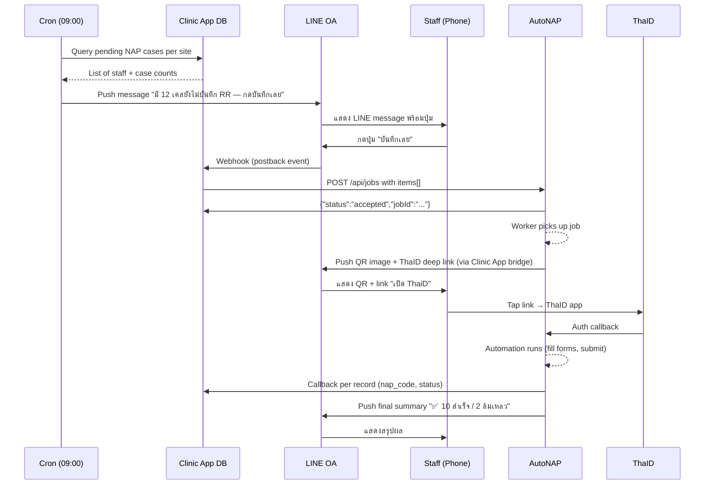

# LINE OA × AutoNAP — Integration Plan

คู่มือออกแบบและติดตั้งระบบ **LINE Official Account + AutoNAP** ให้เป็น notify-and-tap workflow — ลด friction ของการ "เปิดหน้าเว็บแล้วกดบันทึก" ให้เหลือแค่ "กด LINE"

**สถานะ:** Design document (ยังไม่ได้ build)
**เป้าหมาย:** ใช้เป็น blueprint สำหรับ implement ทั้งฝั่ง AutoNAP (repo นี้) และ ACTSE Clinic App

---

## 🎯 เป้าหมายและความคาดหวัง

### ปัญหาปัจจุบัน

```
เจ้าหน้าที่ศูนย์ต้อง:
  1. จำว่าต้องเข้า Clinic App
  2. เปิดหน้า nhsoForReach / nhsoForClinic
  3. เลือกเคสที่ยังไม่บันทึก
  4. กดปุ่ม "บันทึก NAP"
  5. สแกน ThaID QR ใน modal
```

แต่ละเคสที่หลุด = ข้อมูลไม่ครบใน NAP = impact กับ program compliance

### เป้าหมายหลังติดตั้งเสร็จ

```
ทุกวัน 09:00 →
  ระบบดูว่าแต่ละศูนย์มีเคสค้างไหม
  ส่ง LINE message ไปหาเจ้าหน้าที่ผู้รับผิดชอบ
  เจ้าหน้าที่กดปุ่ม "บันทึกเลย" ใน LINE
  → QR + ThaID deep link ส่งกลับใน LINE
  → กด link → ThaID authorize → บันทึกเสร็จ
  → รายงานผลกลับใน LINE
```

---

## 🏗️ Architecture Overview

```
┌─────────────────┐          ┌──────────────────┐          ┌─────────────────┐
│                 │          │                  │          │                 │
│   LINE Server   │◄────────►│  ACTSE Clinic    │◄────────►│     AutoNAP     │
│  (Messaging API)│          │  App (CAREMAT)   │          │  (NAPExpress)   │
│                 │          │                  │          │                 │
└────────┬────────┘          └────────┬─────────┘          └────────┬────────┘
         │                            │                              │
         │ Staff taps                 │ POST /api/jobs              │ Publishes
         │ button                     │                              │ Ably events
         │                            │ ◄─── Callback ───            │
         ▼                            ▼                              ▼
    ┌─────────┐                 ┌─────────┐                   ┌──────────┐
    │ Webhook │                 │  Cron   │                   │   Ably   │
    │ (POST)  │                 │ daily   │                   │ channel  │
    └─────────┘                 └─────────┘                   └──────────┘
```

**บทบาทของแต่ละระบบ:**

| ระบบ | หน้าที่ |
|---|---|
| **ACTSE Clinic App** | 90% ของงานใหม่ — binding, cron, LINE webhook, Ably subscriber, reporting |
| **AutoNAP** | ไม่ต้องแก้อะไรเยอะ — `POST /api/jobs` มีอยู่แล้ว + ส่ง Ably events |
| **LINE Messaging API** | ส่ง/รับ message, webhook สำหรับ button taps |

---

## 🔄 End-to-End Flow (Happy Path)



---

## 📋 PART 1 — Setup LINE OA (สิ่งที่ Wat ต้องทำเองใน LINE Developers Console)

### 1.1 สร้าง LINE Business ID

1. ไปที่ https://account.line.biz/login
2. สร้าง LINE Business ID (ใช้อีเมลเดียวกับที่ใช้บริหาร ACTSE)
3. ยืนยันตัวตนทาง email + phone

### 1.2 สร้าง Provider

1. ไปที่ https://developers.line.biz/console/
2. กด **Create a new provider**
3. ตั้งชื่อ **ACTSE Clinic** (จะเป็นชื่อองค์กรที่แสดงใน Privacy policy)

### 1.3 สร้าง Messaging API Channel

1. ใน provider ที่สร้าง → **Create a new channel**
2. เลือก **Messaging API**
3. กรอกข้อมูล:
   - Channel name: `ACTSE Clinic — AutoNAP Bot`
   - Channel description: ระบบแจ้งเตือนและสั่งบันทึก NAP อัตโนมัติ
   - Category: `Medical / Healthcare`
   - Subcategory: `Clinic`
   - Email: อีเมลคุณ
4. ยอมรับ terms → **Create**

### 1.4 เก็บค่า credentials

หลังสร้างเสร็จไปที่ tab **Messaging API**:

| Field | ต้องคัดลอกไปเก็บใน `.env` |
|---|---|
| **Channel access token (long-lived)** | `LINE_CHANNEL_ACCESS_TOKEN` (กด **Issue** ถ้ายังไม่มี — เก็บค่านี้แน่น!) |
| **Channel secret** (อยู่ tab Basic settings) | `LINE_CHANNEL_SECRET` |
| **Bot basic ID** (@xxxxx) | `LINE_BOT_ID` |

### 1.5 ตั้งค่า Messaging Settings

ใน tab **Messaging API** ตั้ง:

| Setting | ค่าที่ตั้ง |
|---|---|
| Use webhook | ✅ Enabled |
| Webhook URL | `https://carematapp.com/api/line/webhook` *(Clinic App)* |
| Webhook redelivery | ✅ Enabled |
| Auto-reply messages | ❌ Disabled |
| Greeting messages | ✅ Enabled (optional — welcome message) |

### 1.6 ตั้งค่า Reply Tokens และ Rich Menu (optional)

- **Reply messages:** ใช้ push messages เป็นหลัก → disable
- **Rich menu:** สร้างเพิ่มเติมทีหลังได้ (ปุ่มเช่น "เคสค้าง RR วันนี้", "รายงานเมื่อวาน") — Phase 2+

### 1.7 เพิ่มบัญชีสำหรับทดสอบ

1. สแกน QR code ของ LINE OA ด้วยมือถือ
2. Add friend
3. ส่ง text ไปเช่น "test" → Clinic App webhook ต้องรับได้

---

## 📋 PART 2 — Environment Variables

### 2.1 ACTSE Clinic App (`.env`)

```bash
# LINE Messaging API
LINE_CHANNEL_ACCESS_TOKEN=xxxxxxxxxxxxxxxxxxxxxxxxxxxxxxxxxxxx
LINE_CHANNEL_SECRET=xxxxxxxxxxxxxxxxxxxxxxxxxxxxxxxxxxxx
LINE_BOT_ID=@xxxxxxx
LINE_WEBHOOK_URL=https://carematapp.com/api/line/webhook

# AutoNAP API (มีอยู่แล้ว)
AUTONAP_API_BASE=https://autonap.actse-clinic.com
AUTONAP_CLIENT_ID=acs_xxxxxxxxxxxxxxx
AUTONAP_CLIENT_SECRET=acsk_xxxxxxxxxxxxxxx

# Ably (subscribe เพื่อ forward event ไป LINE)
ABLY_SUBSCRIBE_KEY=xxxxxxxxx.xxxxxxxxx:xxxxxxxxx

# Reminder cron
LINE_REMINDER_CRON_HOUR=9
LINE_REMINDER_ENABLED=true
```

### 2.2 AutoNAP (`.env`) — ไม่มีอะไรใหม่

AutoNAP ไม่ต้องรู้จัก LINE เลย Clinic App เป็นคน bridge เอง

---

## 📋 PART 3 — Database Changes (ทำใน ACTSE Clinic App)

### 3.1 `line_bindings` table ใหม่

เก็บความสัมพันธ์ระหว่าง staff กับ line_user_id

```sql
CREATE TABLE line_bindings (
    id BIGINT UNSIGNED AUTO_INCREMENT PRIMARY KEY,
    staff_id BIGINT UNSIGNED NOT NULL,
    site_id VARCHAR(50) NOT NULL,
    line_user_id VARCHAR(100) NOT NULL UNIQUE,
    display_name VARCHAR(255),
    picture_url VARCHAR(500),
    linked_at TIMESTAMP NULL,
    unlinked_at TIMESTAMP NULL,
    notify_rr BOOLEAN DEFAULT TRUE,
    notify_vct BOOLEAN DEFAULT TRUE,
    notify_reports BOOLEAN DEFAULT TRUE,
    created_at TIMESTAMP DEFAULT CURRENT_TIMESTAMP,
    updated_at TIMESTAMP DEFAULT CURRENT_TIMESTAMP ON UPDATE CURRENT_TIMESTAMP,
    INDEX idx_staff (staff_id),
    INDEX idx_site (site_id),
    FOREIGN KEY (staff_id) REFERENCES staffs(id)
);
```

### 3.2 `line_link_codes` table ใหม่

Temporary codes สำหรับ binding flow (หมดอายุใน 10 นาที)

```sql
CREATE TABLE line_link_codes (
    code VARCHAR(8) PRIMARY KEY,
    staff_id BIGINT UNSIGNED NOT NULL,
    expires_at TIMESTAMP NOT NULL,
    used_at TIMESTAMP NULL,
    created_at TIMESTAMP DEFAULT CURRENT_TIMESTAMP,
    INDEX idx_expires (expires_at)
);
```

### 3.3 `site_responsibility` table ใหม่ (หรือ ขยาย staff table)

เก็บว่าใครเป็นคนรับผิดชอบ RR/VCT ของแต่ละ site

```sql
CREATE TABLE site_responsibility (
    id BIGINT UNSIGNED AUTO_INCREMENT PRIMARY KEY,
    site_id VARCHAR(50) NOT NULL,
    staff_id BIGINT UNSIGNED NOT NULL,
    form_type ENUM('RR', 'VCT', 'BOTH') NOT NULL,
    is_primary BOOLEAN DEFAULT FALSE,
    created_at TIMESTAMP DEFAULT CURRENT_TIMESTAMP,
    UNIQUE KEY unique_site_staff_form (site_id, staff_id, form_type),
    INDEX idx_site_form (site_id, form_type),
    FOREIGN KEY (staff_id) REFERENCES staffs(id)
);
```

### 3.4 ขยาย `nhso_record_*` tables

เพิ่ม columns สำหรับ filter / exclude record ที่ไม่ต้องส่งเข้า NAP:

```sql
ALTER TABLE nhso_record_nap ADD COLUMN
    exclude_from_nap BOOLEAN DEFAULT FALSE,
    exclude_reason VARCHAR(255) NULL,
    excluded_at TIMESTAMP NULL,
    excluded_by BIGINT UNSIGNED NULL;
```

(ทำแบบเดียวกันกับ `nhso_vct_record`, `nhso_lab_record`, `nhso_result_record`)

### 3.5 `line_reminder_log` table

Track ว่าส่ง reminder อะไรไปแล้วบ้าง (กัน spam + debug)

```sql
CREATE TABLE line_reminder_log (
    id BIGINT UNSIGNED AUTO_INCREMENT PRIMARY KEY,
    staff_id BIGINT UNSIGNED NOT NULL,
    site_id VARCHAR(50) NOT NULL,
    form_type VARCHAR(10) NOT NULL,
    pending_count INT NOT NULL,
    message_id VARCHAR(100) NULL,
    action ENUM('sent','clicked','skipped','failed') NOT NULL,
    meta_json JSON NULL,
    sent_at TIMESTAMP DEFAULT CURRENT_TIMESTAMP,
    INDEX idx_staff_date (staff_id, sent_at),
    INDEX idx_site_date (site_id, sent_at)
);
```

---

## 📋 PART 4 — Staff Binding Flow

**Goal:** เจ้าหน้าที่ผูกบัญชี LINE กับ account Clinic App ของตัวเอง

### 4.1 Setup page ใน Clinic App

`/settings/line-binding`

```
┌─────────────────────────────────────────────┐
│  เชื่อมต่อ LINE OA สำหรับแจ้งเตือนอัตโนมัติ  │
├─────────────────────────────────────────────┤
│                                             │
│  1. Add LINE OA: @actse-autonap-bot         │
│     [สแกน QR Code]                           │
│                                             │
│  2. รหัสเชื่อมต่อของคุณ:                    │
│     ╔═══════════╗                           │
│     ║  4F8K2M   ║  (หมดอายุใน 10 นาที)       │
│     ╚═══════════╝                           │
│                                             │
│  3. ส่งรหัสนี้ใน LINE chat ของ bot          │
│                                             │
│  สถานะ: ⚪ ยังไม่เชื่อมต่อ                  │
│                                             │
└─────────────────────────────────────────────┘
```

### 4.2 Flow (sequence)

```
1. Staff เข้าหน้า /settings/line-binding
2. Clinic App generate code 6-8 chars → save ใน line_link_codes
3. แสดง QR code + รหัสให้ staff
4. Staff:
   a. Add LINE OA as friend
   b. ส่ง text รหัส เช่น "4F8K2M" ในแชท
5. LINE ส่ง webhook มา POST /api/line/webhook
6. Clinic App:
   a. Verify signature (LINE_CHANNEL_SECRET)
   b. ถอดข้อความ event.message.text
   c. ถ้าตรงกับ code ใน line_link_codes + ยังไม่หมดอายุ:
      → สร้าง row ใน line_bindings ด้วย event.source.userId
      → Mark code ใช้งานแล้ว
      → Reply: "✅ เชื่อมต่อสำเร็จ! คุณจะได้รับการแจ้งเตือน RR/VCT"
7. Staff refresh หน้า binding → เห็นสถานะ ✅
```

### 4.3 Endpoint สรุป

| Method | Path | Action |
|---|---|---|
| GET | `/settings/line-binding` | Show QR + code page |
| POST | `/api/line-binding/generate` | สร้าง code ใหม่ (ถ้ากด "รหัสใหม่") |
| POST | `/api/line/webhook` | รับ event จาก LINE (messages, postbacks) |
| DELETE | `/api/line-binding/unlink` | Unlink — set `unlinked_at` + soft delete |

### 4.4 Code sample — Webhook verification

```php
// routes/api.php
Route::post('line/webhook', [LineWebhookController::class, 'handle'])
    ->middleware('verify.line.signature');

// app/Http/Middleware/VerifyLineSignature.php
public function handle($request, Closure $next)
{
    $signature = $request->header('X-Line-Signature');
    $body = $request->getContent();
    $secret = config('services.line.channel_secret');

    $expected = base64_encode(hash_hmac('sha256', $body, $secret, true));

    if (! hash_equals($expected, $signature)) {
        abort(401, 'Invalid signature');
    }

    return $next($request);
}
```

---

## 📋 PART 5 — Case Filtering & Exclusion Design

**Goal:** ศูนย์ระบุได้ว่าเคสไหนต้องการบันทึก NAP เคสไหนไม่ต้อง

### 5.1 Exclusion UI

ในหน้า `nhsoForReach.php` / `nhsoForClinic.php` — เพิ่ม checkbox/button ต่อแถว:

```
┌──────────────────────────────────────────────────────────┐
│ ☑ Select All      ☐ แสดงเฉพาะเคสที่ยังไม่บันทึก        │
├──────────────────────────────────────────────────────────┤
│ ☑  ชภ181133    xxxxxx1967   MSM   21/04   [ใช่]   [ไม่] │
│ ☑  สพ301127    xxxxxx0032   FSW   21/04   [ใช่]   [ไม่] │
│ ☐  ณค290850    xxxxxx0661   MSM   21/04   [ใช่] ▊[ไม่]▊ │   ← excluded
│                             ↑ ข้ามไม่บันทึก: ผู้รับฯ ปฏิเสธ │
└──────────────────────────────────────────────────────────┘
       [บันทึก NAP ที่เลือก]   [กดไม่บันทึกทั้งหมด]
```

### 5.2 Exclusion reasons (dropdown)

| Reason code | ความหมาย |
|---|---|
| `patient_declined` | ผู้รับบริการปฏิเสธให้บันทึก |
| `incomplete_data` | ข้อมูลไม่ครบ (รอแก้ไข) |
| `test_only_no_record` | ตรวจเพื่อคัดกรอง ไม่ขึ้น NAP |
| `duplicate_other_site` | ซ้ำกับที่ศูนย์อื่นบันทึกแล้ว |
| `other` | อื่นๆ (มี text note) |

### 5.3 Filter logic ใน cron

เวลา daily cron query pending cases → **ต้องกรอง excluded records ออก:**

```sql
SELECT * FROM nhso_record_nap
WHERE site_id = :site
  AND form_type = 'RR'
  AND nap_code IS NULL
  AND (exclude_from_nap = FALSE OR exclude_from_nap IS NULL)
  AND service_date <= CURDATE()
```

### 5.4 Re-include

ถ้า staff เปลี่ยนใจ — มีปุ่ม "เปิดให้บันทึกอีกครั้ง" → set `exclude_from_nap = FALSE`, clear reason

---

## 📋 PART 6 — Site Responsibility Assignment

**Goal:** กำหนดว่าใครรับผิดชอบ RR/VCT ของแต่ละ site — cron จะได้รู้ว่าต้อง ping ใคร

### 6.1 Admin UI

`/settings/site-responsibility`

```
┌────────────────────────────────────────────────────────┐
│ ผู้รับผิดชอบงาน NAP                                   │
├────────────────────────────────────────────────────────┤
│ Site: mplus_cmi                                        │
│                                                        │
│   RR  → [สมศรี ใจดี]     [✕]  [+ เพิ่ม primary/backup] │
│   VCT → [อรรถพล ชัย]    [✕]                           │
│                                                        │
│ Site: mplus_plk                                        │
│   RR  → [สุวรรณี พัฒน์]  [✕]                          │
│   VCT → [สุวรรณี พัฒน์]  [✕]  (เดียวกัน OK)           │
│                                                        │
│                                [+ เพิ่ม site responsibility] │
└────────────────────────────────────────────────────────┘
```

### 6.2 Fallback hierarchy

ถ้า primary ไม่มี LINE binding → ส่งหา backup → ถ้าไม่มีอีก → ส่งหา site admin

```
Primary (is_primary=TRUE) → ถ้า line_binding active
   ↓ else
Any responsible staff for this (site, form_type) → ถ้ามี line_binding
   ↓ else
Site admin account
   ↓ else
Skip + log warning
```

### 6.3 Rule

- 1 site ต้องมีอย่างน้อย 1 responsible person ต่อ form_type (RR, VCT)
- เพิ่ม backup ได้กี่คนก็ได้
- ถ้าอยากให้ทุกคนรับ notification → สร้าง responsibility ครบทุกคน

---

## 📋 PART 7 — Daily Reminder Cron

### 7.1 Schedule

ใน `app/Console/Kernel.php` (Clinic App):

```php
protected function schedule(Schedule $schedule): void
{
    // Daily reminder 09:00 ทุกวัน
    $schedule->command('line:remind-pending-nap')
        ->dailyAt('09:00')
        ->timezone('Asia/Bangkok')
        ->onOneServer();
}
```

### 7.2 Command logic

`php artisan line:remind-pending-nap`

```
FOR EACH active site:
    FOR EACH form_type IN ['RR', 'VCT']:
        pending = query_pending_cases(site, form_type)
        IF pending.count == 0: continue

        primary = get_primary_responsible(site, form_type)
        IF primary.line_binding exists AND notify_{form_type} = TRUE:
            send_line_reminder(primary, pending)
            log_reminder(primary, site, form_type, count)
        ELIF backup exists:
            send_line_reminder(backup, pending)
        ELSE:
            log("no responsible staff with LINE for {site}/{form_type}")
```

### 7.3 ตัวอย่าง LINE message (Flex message)

```
┌─────────────────────────────────────┐
│ 📋 เคสค้างบันทึก NAP                │
├─────────────────────────────────────┤
│ mplus_plk                           │
│                                     │
│  RR: 12 เคส (22–23 เม.ย.)           │
│  วันที่เก่าสุด: 21/04/2569           │
│                                     │
│  [▶ บันทึกเลย]   [ดูรายการ]   [ข้าม] │
├─────────────────────────────────────┤
│ AutoNAP • 24/04/2569 09:00          │
└─────────────────────────────────────┘
```

### 7.4 Idempotency

กัน cron ยิงซ้ำถ้ารันหลายครั้ง:
- Check `line_reminder_log` — ถ้าส่ง reminder ให้ staff คนนี้วันเดียวกันสำหรับ (site, form_type) นี้แล้ว → skip
- Retry logic: ถ้า LINE API ล้ม → retry 2 ครั้ง แล้วบันทึก action='failed'

---

## 📋 PART 8 — Tap-to-Trigger Flow

### 8.1 Postback event structure

LINE ส่ง webhook เมื่อ staff กดปุ่มใน Flex message:

```json
{
  "events": [{
    "type": "postback",
    "replyToken": "xxxxxx",
    "source": {"type": "user", "userId": "Uxxxxxx"},
    "postback": {
      "data": "action=start_autonap&site=mplus_plk&form=RR&reminder_id=42"
    }
  }]
}
```

### 8.2 Webhook handler

```php
// app/Http/Controllers/LineWebhookController.php
public function handle(Request $request)
{
    foreach ($request->input('events') as $event) {
        match ($event['type']) {
            'message'  => $this->handleMessage($event),
            'postback' => $this->handlePostback($event),
            'follow'   => $this->handleFollow($event),
            'unfollow' => $this->handleUnfollow($event),
            default    => null,
        };
    }

    return response()->json(['ok' => true]);
}

protected function handlePostback(array $event): void
{
    parse_str($event['postback']['data'], $data);
    $lineUserId = $event['source']['userId'];

    $binding = LineBinding::where('line_user_id', $lineUserId)
        ->whereNull('unlinked_at')->first();

    if (! $binding) {
        $this->lineReply($event['replyToken'], 'กรุณาเชื่อมต่อบัญชีที่หน้า Settings ก่อน');
        return;
    }

    if ($data['action'] === 'start_autonap') {
        $this->startAutoNapJob($binding, $data['site'], $data['form'], $data['reminder_id']);
    }
}

protected function startAutoNapJob(LineBinding $binding, string $site, string $form, int $reminderId): void
{
    // 1. รวบรวม pending items
    $items = $this->collectPendingItems($site, $form);

    // 2. สร้าง ably channel per staff (เพื่อ route event กลับ LINE ของเขา)
    $ablyChannel = "line-bridge:{$binding->line_user_id}:" . uniqid();

    // 3. Subscribe ably channel BEFORE posting job — forward events ไป LINE
    LineAblyBridge::listen($ablyChannel, $binding->line_user_id);

    // 4. POST /api/jobs ไป AutoNAP
    $response = Http::withToken($this->autonapToken())
        ->post(config('services.autonap.base_url') . '/api/jobs', [
            'site' => $site,
            'fy' => now()->year + 543,
            'form_type' => $form,
            'nap_username' => $this->napCreds($site)['username'],
            'nap_password' => $this->napCreds($site)['password'],
            'callback_url' => config('app.url') . '/api/autonap_callback.php',
            'ably_channel' => $ablyChannel,
            'staff_name' => $binding->staff->name,
            'items' => $items,
        ]);

    // 5. บันทึกใน reminder log ว่า clicked
    LineReminderLog::where('id', $reminderId)->update(['action' => 'clicked']);

    // 6. Push status message ไป LINE
    $this->linePush($binding->line_user_id, "🔄 เริ่มประมวลผล {$form} {$site} ({$this->count($items)} รายการ)...");
}
```

### 8.3 ThaID QR delivery via LINE

AutoNAP ยิง Ably event `job:qr` พร้อม base64 image — Clinic App subscribe แล้ว forward ไป LINE

```php
// app/Services/LineAblyBridge.php
public static function listen(string $channel, string $lineUserId): void
{
    // ใช้ Ably Realtime SDK (subscribe) หรือ
    // คุยผ่าน Ably REST long-polling จาก cron/queue worker

    $ably = new Ably\AblyRest(config('services.ably.key'));
    $ablyChannel = $ably->channels->get($channel);

    $ablyChannel->subscribe('job:qr', function ($msg) use ($lineUserId) {
        $data = $msg->data;
        self::pushImage($lineUserId, $data['qr_base64']);
        self::pushText($lineUserId, "หรือกดเปิด ThaiD ที่: {$data['deep_link']}");
    });

    $ablyChannel->subscribe('job:complete', function ($msg) use ($lineUserId) {
        $data = $msg->data;
        self::pushText($lineUserId,
            "📊 สรุป: สำเร็จ {$data['success']} / ล้มเหลว {$data['failed']} / ทั้งหมด {$data['total']}"
        );
    });

    $ablyChannel->subscribe('job:record:failed', function ($msg) use ($lineUserId) {
        $data = $msg->data;
        self::pushText($lineUserId, "❌ ล้มเหลว: {$data['uic']} — {$data['error']}");
    });
}
```

**ข้อควรระวัง:** Ably Realtime ใน PHP รันยาก (ไม่มี event loop พื้นฐาน) — แนะนำใช้ **long-running queue worker** subscribe ผ่าน node bridge หรือ REST polling

**ทางเลือก:** AutoNAP push webhook ไป Clinic App ตรงๆ (แทน Ably) — Clinic App forward ไป LINE

```
Alternative design:
  AutoNAP → HTTP POST /api/line-bridge/push {event:"qr", data:{...}}
  Clinic App → LINE Push message to the staff who started the job
```

### 8.4 ThaID authentication flow

Deep link `cdt://...` ทำงานบน LINE mobile browser อยู่แล้ว (feature `4027c5a`) → staff กด link ใน LINE app → OS ถาม "Open in ThaiD?" → ยืนยัน → ThaiD auth เสร็จ → AutoNAP ได้ session cookies → รันต่อ

**ไม่มีอะไรต้องเปลี่ยนในฝั่ง AutoNAP**

---

## 📋 PART 9 — Reporting Flow

### 9.1 Real-time (ระหว่าง job รัน)

ส่ง LINE message ตาม event ที่ได้จาก Ably:

| Event | LINE Message |
|---|---|
| `job:start` | 🔐 เริ่มบันทึก {form} {site} ({total} เคส) |
| `job:preparing` | 📋 กำลังเตรียมข้อมูล... |
| `job:record:success` (ทุก 5 รายการ) | ✅ ความคืบหน้า: {current}/{total} |
| `job:record:failed` | ❌ เคส {uic} — {error} |
| `job:complete` | 📊 สรุป: สำเร็จ {success} / ล้มเหลว {failed} |

### 9.2 Daily digest (end of day)

ส่งวันละ 1 ครั้ง 18:00 สรุปผลรวมของวัน:

```
📊 สรุปการบันทึก NAP วันนี้ (24/04/2569)

mplus_plk (สุวรรณี)
  RR:  12/12 ✅
  VCT: 8/10 ⚠️ (2 ล้มเหลว)

mplus_cmi (สมศรี)
  RR:  45/45 ✅
  VCT: 32/32 ✅

รวม: 97/99 (98%)

ดู dashboard: https://autonap.actse-clinic.com/dashboard
```

### 9.3 Monthly report (optional, Phase 4)

- Total cases recorded per staff per month
- Avg submission time from service_date
- Success rate trends
- Top errors

---

## 📋 PART 10 — AutoNAP Repository Changes

### 10.1 สิ่งที่ต้องแก้ใน AutoNAP (this repo) — **น้อยมาก**

ส่วนใหญ่คือ enhancement optional:

#### 10.1.1 (Optional) Forward webhook endpoint

ถ้าเลือก design alternative (AutoNAP push webhook ตรงไป Clinic App แทน Ably subscription):

```php
// routes/api.php
Route::post('jobs/{jobId}/line-forward', [AutoNapJobController::class, 'lineForward']);
```

แต่จริงๆ **Ably pattern ใช้ได้อยู่แล้ว** — Clinic App subscribe เอง

#### 10.1.2 (Required) ต้องรับ `staff_name` + channel per-staff

POST /api/jobs payload ปัจจุบันรับ `staff_name` อยู่แล้ว ✅
`ably_channel` ก็รับอยู่แล้ว ✅

→ **ไม่ต้องแก้อะไร**

#### 10.1.3 (Optional) Endpoint คืน "pending count per site"

เพื่อให้ cron ของ Clinic App query ง่ายๆ:

```
GET /api/sites/{site}/pending
→ { "RR": 12, "VCT": 8 }
```

แต่จริงๆ Clinic App มี data ในตัวอยู่แล้ว — **น่าจะไม่ต้องสร้าง**

### 10.2 ไฟล์ที่น่าจะไม่แตะใน AutoNAP

- `automation/thaid_login_and_record.cjs` — ไม่แตะ
- `app/Jobs/ProcessAutoNapJob.php` — ไม่แตะ
- `app/Services/NapCallbackService.php` — ไม่แตะ
- `app/Services/AblyProgressService.php` — ไม่แตะ

**สรุป: 95%+ ของงานอยู่ใน ACTSE Clinic App repo**

---

## 📋 PART 11 — Security & PDPA

### 11.1 LINE webhook signature verification

**บังคับ!** ใช้ `X-Line-Signature` + HMAC-SHA256 ตรวจทุก request (ดู Part 4.4)

### 11.2 Line user id ≠ PII — แต่ binding เป็น PII

- `line_user_id` เป็น opaque identifier — ไม่มี name/phone/email
- แต่ table `line_bindings` ที่เก็บ (staff_id + line_user_id + display_name) **เป็น PII**
- → encrypt `display_name` / `picture_url` at rest ถ้าจำเป็น

### 11.3 อย่าส่ง PID 13 หลักใน LINE

- ใน reminder message ใช้ **UIC + masked PID** (เช่น `xxxx1234`) เท่านั้น
- ข้อมูล sensitive ให้ link ไปเปิดใน Clinic App (auth required)

### 11.4 Audit log

```php
// ทุก webhook event + ทุกการกด button
LineAuditLog::create([
    'line_user_id' => $lineUserId,
    'event_type' => $event['type'],
    'payload_hash' => sha1(json_encode($event)),
    'created_at' => now(),
]);
```

### 11.5 Unbinding / Right to be forgotten

- User ส่ง text "unlink" หรือ "ยกเลิก" → ลบ line_binding
- User block LINE OA → LINE ส่ง `unfollow` event → mark `unlinked_at`

---

## 📋 PART 12 — Error Handling

### 12.1 LINE API failures

| Error | Mitigation |
|---|---|
| Messaging API quota เต็ม (free 1000/mo) | Log + fallback email + upgrade plan |
| Network error | Retry 2 ครั้ง exponential backoff |
| Invalid user id (blocked) | Mark binding as inactive |

### 12.2 Staff ไม่มี LINE binding

- Cron skip staff คนนั้น แต่ **ส่ง email fallback** ถ้ามี
- Dashboard show warning "X staff ยังไม่ได้ link LINE"

### 12.3 AutoNAP down

- Clinic App ลอง POST → ถ้า fail → แจ้ง staff ใน LINE "ระบบ AutoNAP ชั่วคราวไม่พร้อม — ลองใหม่ภายหลัง"
- Log incident สำหรับ retry later

### 12.4 ThaID timeout

- ปัจจุบัน 60 วินาที — ถ้า staff ไม่สแกน → AutoNAP job failed
- LINE message: "⏰ หมดเวลาสแกน ThaiD — กดปุ่มใหม่อีกครั้งได้เลย"

---

## 📋 PART 13 — Implementation Phases

### Phase 1 — Foundation (Week 1-2)

**Goal:** Staff binding + manual trigger via LINE (ยังไม่มี cron)

- [ ] Setup LINE OA + channel
- [ ] Add env vars ใน Clinic App
- [ ] สร้าง tables: `line_bindings`, `line_link_codes`, `line_reminder_log`
- [ ] `LineWebhookController::handle()` สำหรับ message / postback
- [ ] Middleware `VerifyLineSignature`
- [ ] `/settings/line-binding` page + code generator
- [ ] Test: staff ส่ง code ใน LINE → บันทึก binding

**Deliverable:** staff กดปุ่ม "ทดสอบส่ง LINE" ใน Settings → รับ ping ใน LINE

### Phase 2 — Case exclusion + responsibility (Week 3)

- [ ] Migration เพิ่ม `exclude_from_nap` ใน nhso tables
- [ ] UI checkbox "ไม่บันทึก" + reason dropdown
- [ ] `site_responsibility` table + admin UI
- [ ] Pending count query (filter exclude + responsibility)

**Deliverable:** Admin กำหนดผู้รับผิดชอบได้ + staff mark exclude ได้

### Phase 3 — Daily reminder (Week 4)

- [ ] Artisan command `line:remind-pending-nap`
- [ ] Schedule ใน Kernel.php
- [ ] Flex message template
- [ ] Postback handler → POST /api/jobs
- [ ] Idempotency + reminder log

**Deliverable:** วันรุ่งขึ้น 09:00 ได้ LINE ping จริง

### Phase 4 — Real-time updates via Ably bridge (Week 5-6)

- [ ] `LineAblyBridge` service — subscribe Ably → forward LINE
- [ ] QR image forwarding
- [ ] Progress updates (rate-limit 1 per 5 records)
- [ ] Final summary message

**Deliverable:** ThaiD QR + progress ปรากฏใน LINE crystal clear

### Phase 5 — Reporting (Week 7)

- [ ] Daily digest (18:00 cron)
- [ ] Monthly report (optional)

**Total estimate:** 6-7 สัปดาห์สำหรับ 1 dev

---

## 📋 PART 14 — Testing Plan

### 14.1 Unit tests

- LineSignatureVerifier (pass/fail cases)
- LineMessageBuilder (Flex template rendering)
- PendingCaseCounter (with exclude filter)

### 14.2 Integration tests

- Mock LINE Messaging API + test webhook handler
- Mock AutoNAP API + test trigger flow
- Mock Ably + test event forwarding

### 14.3 Manual test scenarios

- [ ] Binding: staff ส่ง code ผิด → reject
- [ ] Binding: code หมดอายุ → reject
- [ ] Binding: 1 line_user_id ไม่ bind 2 staff
- [ ] Reminder: skip staff ที่ไม่มี binding
- [ ] Reminder: Idempotent — รัน cron 2 ครั้ง ได้ message แค่ครั้งเดียว
- [ ] Trigger: กด "บันทึก" → job สำเร็จ → summary กลับมาใน LINE
- [ ] Error: AutoNAP down → LINE แจ้งศูนย์

---

## 📋 PART 15 — Final Checklist for Wat

### ก่อนเริ่ม dev

- [ ] สร้าง LINE Business ID
- [ ] สร้าง Provider "ACTSE Clinic"
- [ ] สร้าง Messaging API channel
- [ ] เก็บ Channel token + secret + bot id
- [ ] Test add friend LINE OA ด้วยมือถือ

### ก่อน deploy Phase 1

- [ ] เพิ่ม env vars ใน `.env` production ของ Clinic App
- [ ] Migration `line_bindings`, `line_link_codes`, `line_reminder_log`
- [ ] Deploy webhook endpoint
- [ ] Configure Webhook URL ใน LINE Developers Console
- [ ] Verify webhook ได้ signal จาก LINE (ปุ่ม Verify ใน console)

### ก่อน deploy Phase 3

- [ ] Cron schedule ตั้งใน supervisor/crontab
- [ ] Test daily ping ด้วย 1-2 staff ทดลอง
- [ ] Backup/rollback plan ถ้า cron มีปัญหา

### Go-live readiness

- [ ] อย่างน้อย 3 staff ของ 2 site test binding แล้ว
- [ ] Document ภาษาไทย 1 หน้า สำหรับ onboard staff ใหม่
- [ ] Support channel (LINE group / email) สำหรับ user issue

---

## 📋 PART 16 — Open Questions / Decisions Needed

- [ ] **Free LINE tier จำกัด 1,000 ข้อความ/เดือน** — 17 site × 2 form × 1 reminder × 30 วัน = 1,020 messages/เดือน ไม่รวม progress/summary — **ต้องขึ้น Light Plan ฿1,200/เดือน หรือ Premium ฿3,400/เดือน** (Light ยืดหยุ่นพอ)
- [ ] **Rich menu ทำเลยไหม** — ถ้าทำ "กดดูเคสค้าง" จะดี แต่ Phase 5
- [ ] **1 staff รับหลาย site?** — staff mplus_plk + mplus_nma คนเดียวกัน ก็ระบุ site_responsibility ได้หลาย row
- [ ] **LINE group แทน 1-1?** — ศูนย์ใหญ่อาจต้องการให้หัวหน้าเห็นด้วย → ต้องรองรับ LINE group binding (ซับซ้อนกว่า — Phase 5+)
- [ ] **Staff turnover** — staff ลาออก → unlink ยังไง ใครเป็นคน track
- [ ] **Multi-language** — ตอนนี้ Thai only ก็พอ

---

## 📚 References

- LINE Messaging API docs: https://developers.line.biz/en/reference/messaging-api/
- LINE Flex Message simulator: https://developers.line.biz/flex-simulator/
- LINE webhook security: https://developers.line.biz/en/reference/messaging-api/#signature-validation
- Ably Realtime PHP docs: https://ably.com/docs/realtime/channels (แต่ PHP SDK มีแต่ REST — subscribe ต้องใช้ polling หรือ bridge)

---

## 🏁 สรุป

| เรื่อง | คำตอบ |
|---|---|
| **มีอะไรใหม่ที่ AutoNAP repo?** | แทบไม่มี — `POST /api/jobs` ใช้ได้เลย + Ably events พร้อม |
| **งานหลักอยู่ที่ไหน?** | ACTSE Clinic App — 95% ของ implementation |
| **ใช้เวลาเท่าไร?** | 6-7 สัปดาห์ (1 dev) สำหรับครบ Phase 1-5 |
| **Minimum viable version?** | Phase 1 + 3 (3-4 สัปดาห์) — binding + daily reminder + manual trigger via LINE |
| **Monthly infrastructure cost เพิ่ม?** | ~฿1,200 (LINE Light plan) + existing VPS |
| **Impact ต่อ sales pitch 100+ orgs?** | สูงมาก — เปลี่ยน "AutoNAP semi-auto" เป็น "fully auto" — เหตุผลบวกชัดที่สุดในการขาย |

**เริ่ม Phase 1 เมื่อ Wat พร้อม — ไม่ต้องทำในโปรเจกต์เดียว แบ่งเป็นหลาย PR ใน ACTSE Clinic repo**
